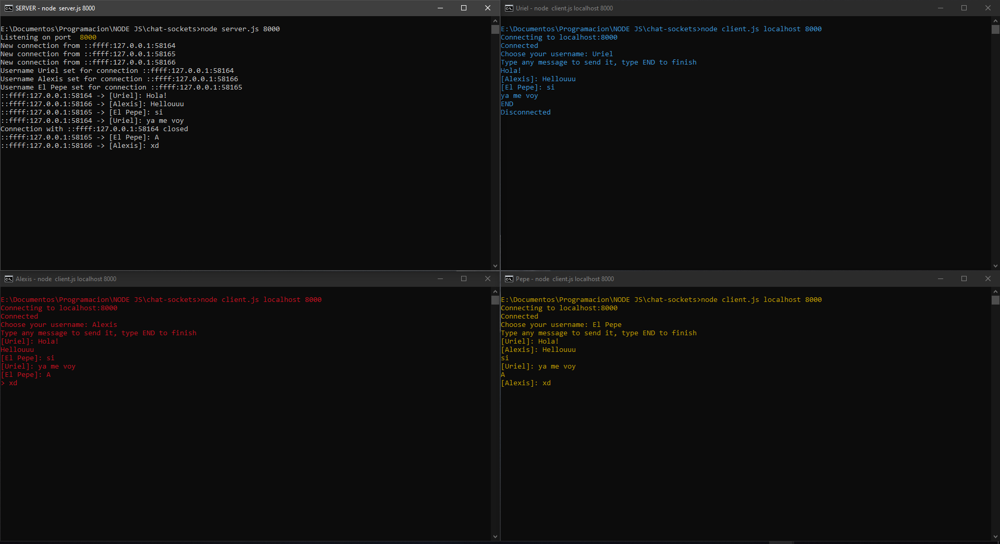

# Sockets TCP con NodeJS

En esta práctica se crea un servidor al cual se conectarán otros clientes mediante sockets TCP para el intercambio de información tipo chat. Los paquetes utilizados son de los preinstalados en Node, así que no se necesita instalación adicional a Node.

## Usage (server)

`node server {PORT}`    `{PORT}`: es el puerto en el que se desea abrir el servidor. (p. ej. `node server 8000`)

## Usage (client)

`node client {HOST} {PORT} `    `{HOST}` es el nombre del dominio al que se desea conectar   `{PORT}` es el puerto del servidor al que se desea conectar.

(p. ej. `node client localhost 8000`)

## DEMO

